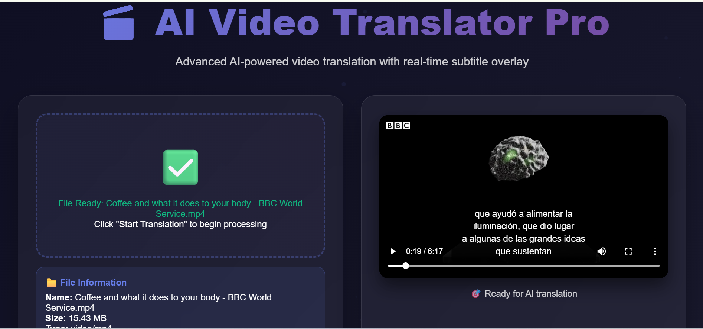
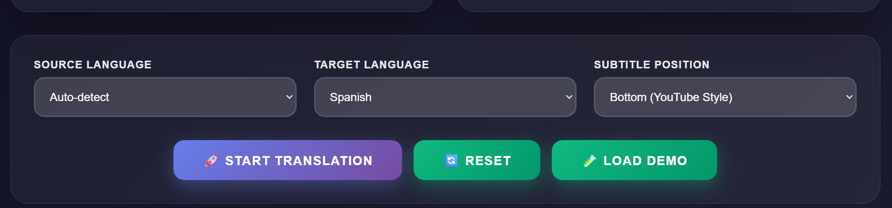
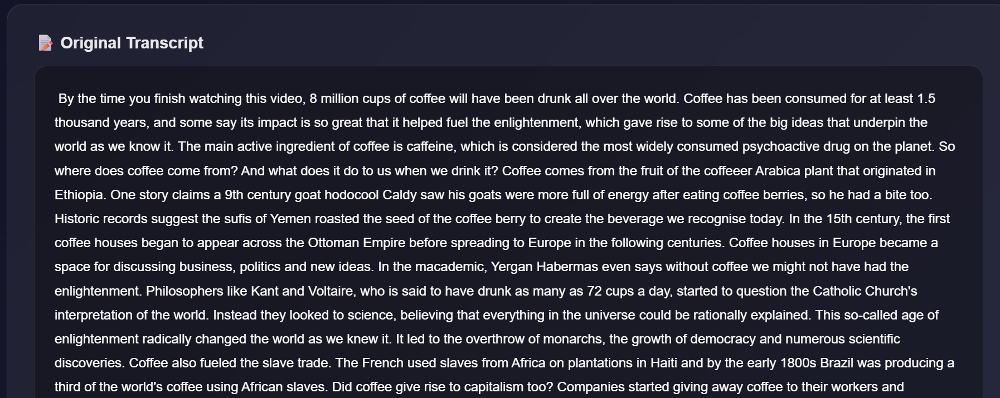
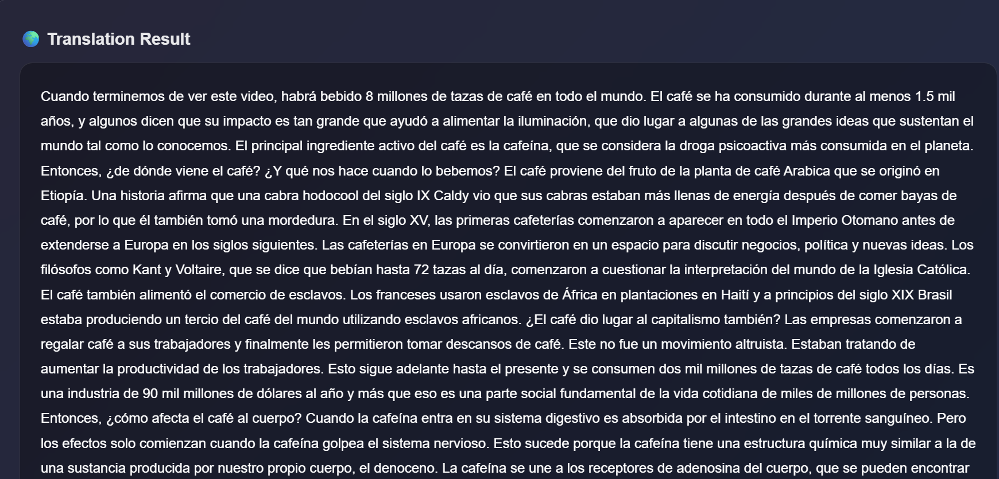

# 🎬 AI Video Translator Pro

**AI Video Translator Pro** is an open-source platform that allows users to upload videos, automatically transcribe audio, translate it into multiple languages, and optionally embed subtitles directly into the video using FFmpeg.

---
## 🖼️ Demo Screenshots

### 📤 Uploading a Video + 📺 Subtitles Overlaid on Video


### 🧠 Transcription + Translation Result

<p align="center">
  
  
</p>


---

## 🚀 Features

* 🎥 Upload `.mp4`, `.mov`, `.avi`, `.mkv` videos
* 🧠 Transcribe audio using OpenAI Whisper
* 🌍 Translate transcripts via Hugging Face (NLLB model)
* 📝 Generate `.srt` subtitle files
* 🔥 Burn subtitles into videos using FFmpeg
* 💻 Modern frontend UI with real-time subtitle overlay

---

## 🛠️ Tech Stack

* **Backend:** FastAPI, Python
* **AI Models:** Whisper (OpenAI), NLLB-200 (Meta via Hugging Face)
* **Frontend:** HTML, CSS, JavaScript
* **Video Processing:** FFmpeg

---

## 📦 Installation

```bash
# Clone the repository
https://github.com/your-username/video-translator.git
cd video-translator

# Create a virtual environment
python -m venv .venv
source .venv/bin/activate  # or .venv\Scripts\activate on Windows

# Install dependencies
pip install -r requirements.txt

# Make sure FFmpeg is installed and available in PATH
ffmpeg -version

# Run the FastAPI server
uvicorn app.main:app --reload --host 127.0.0.1 --port 8000
```

Then open your browser to: `http://127.0.0.1:8000`

---

## 🧪 Example Use Case

1. Upload a video
2. Select source & target language
3. Click "Start Translation"
4. View transcript + translated text
5. Download `.srt` or burn subtitles directly into a new video

---

## 📄 License

This project is licensed under the MIT License. See the [LICENSE](LICENSE) file for details.

---

## 🙌 Contributing

Pull requests are welcome! For major changes, please open an issue first.

---

## 🌐 Credits

* [OpenAI Whisper](https://github.com/openai/whisper)
* [Facebook NLLB](https://huggingface.co/facebook/nllb-200-distilled-600M)
* [FFmpeg](https://ffmpeg.org/) for video/audio processing
